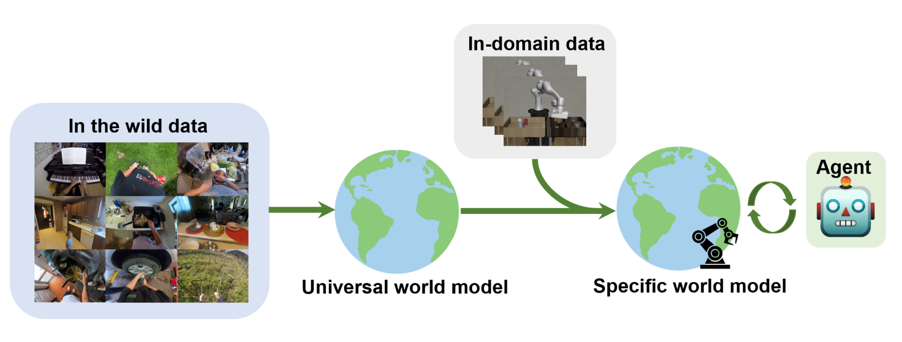

<div align="center">

# A Universal World Model Learned from Large-Scale and Diverse Videos

**NeurIPS 2023 · Foundation Models for Decision Making Workshop**

<!-- [](https://openreview.net/forum?id=lw5GlytIY5) -->
[](https://openreview.net/pdf?id=lw5GlytIY5)
[](https://drive.google.com/file/d/1cJRLMlkC2s4FbOA2sBLbbKrO9SO2Fuk5/view)

</div>

This repository is the official PyTorch implementation of the paper **"A Universal World Model Learned from Large-Scale and Diverse Videos."**

**TL;DR.** We learn a universal world model from large-scale, diverse videos by encoding adjacent frames, extracting latent actions via vector quantization (VQ), and learning dynamics in the latent space; the model generalizes across domains and can be efficiently adapted with limited in-domain data.

<div align="center">



</div>

---

## Method Overview

- **Observation encoding:** Encode adjacent frames into state representations (e.g., CNN or ViT/MAE-based).
- **Latent actions:** Extract discrete/continuous latent actions from state transitions via VQ (`LatentActionGen`, `VectorQuantizer` / `VectorQuantizer1D`, `BottleneckBlock`).
- **Dynamics model:** Predict next state in latent space with the `Dynamic` module, supporting multi-step rollout.
- **Decoding & reconstruction:** `Decoder`, `Reconstruct`, etc., for image reconstruction and evaluation.

Supported data: Atari replays, Something-Something v2 (frames/video), Ego4D, RoboNet, and other diverse video sources.

---

## Repository Structure

| File / Dir | Description |
|------------|-------------|
| `config.py` | Global config (dataset, batch size, learning rate, latent dims, VQ codebook size, etc.) |
| `pretrain.py` | Pretraining entry: model build, data loading, training loop, and evaluation |
| `model.py` | Core models: `RepresentationNetwork`, `Decoder`, `LatentActionGen`, `Dynamic`, `Reconstruct`, VQ, etc. |
| `models_mae.py` | MAE ViT encoder (optional, for image observations) |
| `atari.py` | Atari dataset (replay observations/actions/rewards) |
| `ssv2.py` | SSv2 / Ego4D datasets (frames or video) |
| `transform.py` | Data augmentation (e.g., Kornia) |
| `tools.py` | Data loaders, logging, loss utilities |
| `test.py` | Model loading and visualization (`prepare_model`, `show_image`, etc.) |
| `metric.py` | Evaluation (e.g., LPIPS, R3M) |
| `util/` | Positional embedding, LR scheduling, dataset helpers, etc. |

---

## Environment & Dependencies

- **Python 3**, **PyTorch** (match your CUDA version as needed).
- Main deps: `torch`, `torchvision`, `numpy`, `timm`, `kornia`, `lpips`, `skvideo`, `opencv-python`, `matplotlib`, `PIL`.
- Optional: `r3m` (for metrics), `omegaconf`, `hydra` (for metric scripts).

Install in a virtual environment:

```bash
pip install torch torchvision numpy timm kornia lpips opencv-python matplotlib Pillow scikit-video
# For evaluation scripts: pip install r3m omegaconf hydra
```

---

## Data

- **Atari:** Set the game (e.g., `Breakout`) via `-s` in `config.py`. The data path is hardcoded in `atari.py` as `self.path`; point it to your replay directory (with `replay_logs/` and `$store$_observation_ckpt.*.gz`, etc.).
- **SSv2:** Use `ssv2Dataset` (pre-extracted frames) or `ssv2VideoDataset` (raw video); set `image_path` in `pretrain.py`.
- **Ego4D / RoboNet:** Use `ego4dDataset` and set `image_path` in `pretrain.py` (current example: `/public/share_dataset/chc/robonet_frames`).  
Update `train_dataset` / `eval_dataset` paths in `pretrain.py` to your own data paths before running.

---

## Training

1. **Configuration**  
   - In `config.py`: set dataset (`-s`), device (`-d`), batch size (`-b`), learning rate (`-l`/`--blr`), channel (`-c`), etc., via CLI or defaults.  
   - In `pretrain.py`: additional args include `--epochs`, `--lr`, `--opt`, `--sched`, `--warmup-epochs`, etc.

2. **Single-machine training**  
   - Ensure the dataset and paths in `pretrain.py` are correct (e.g., Ego4D/RoboNet `image_path`).  
   - Run:
   ```bash
   python pretrain.py --epochs 20
   ```

3. **Multi-GPU (distributed)**  
   - The code uses `DistributedSampler` and distributed init. Launch with (e.g., 8 GPUs):
   ```bash
   torchrun --nproc_per_node=8 pretrain.py
   ```

4. **Switching datasets**  
   - In `pretrain()` in `pretrain.py`, comment/uncomment the appropriate `train_dataset` and `eval_dataset` (Atari / SSv2 / Ego4D / RoboNet) and update the paths.

---

## Evaluation & Visualization

- **Visualization:** Use `prepare_model`, `show_image`, `show_latent_diff` in `test.py` to load a checkpoint and visualize reconstructions or latent differences.
- **Metrics:** Run `metric.py` to compute LPIPS and related metrics (requires `lpips`, optional `r3m`). Set model and data paths inside the script.

---

## Citation

If you find this repository or the paper useful, please cite:

```bibtex
@inproceedings{cui2023universal,
  title={A universal world model learned from large scale and diverse videos},
  author={Cui, Hanchen and Gao, Yang},
  booktitle={NeurIPS 2023 Foundation Models for Decision Making Workshop},
  year={2023}
}
```

---

## License

Parts of the code (e.g., `models_mae.py`) are from Meta’s MAE implementation and follow their original LICENSE; the rest is subject to the LICENSE in this repository.
